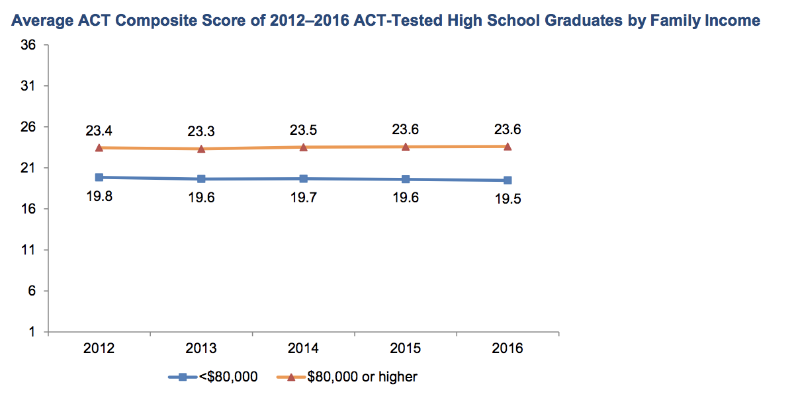
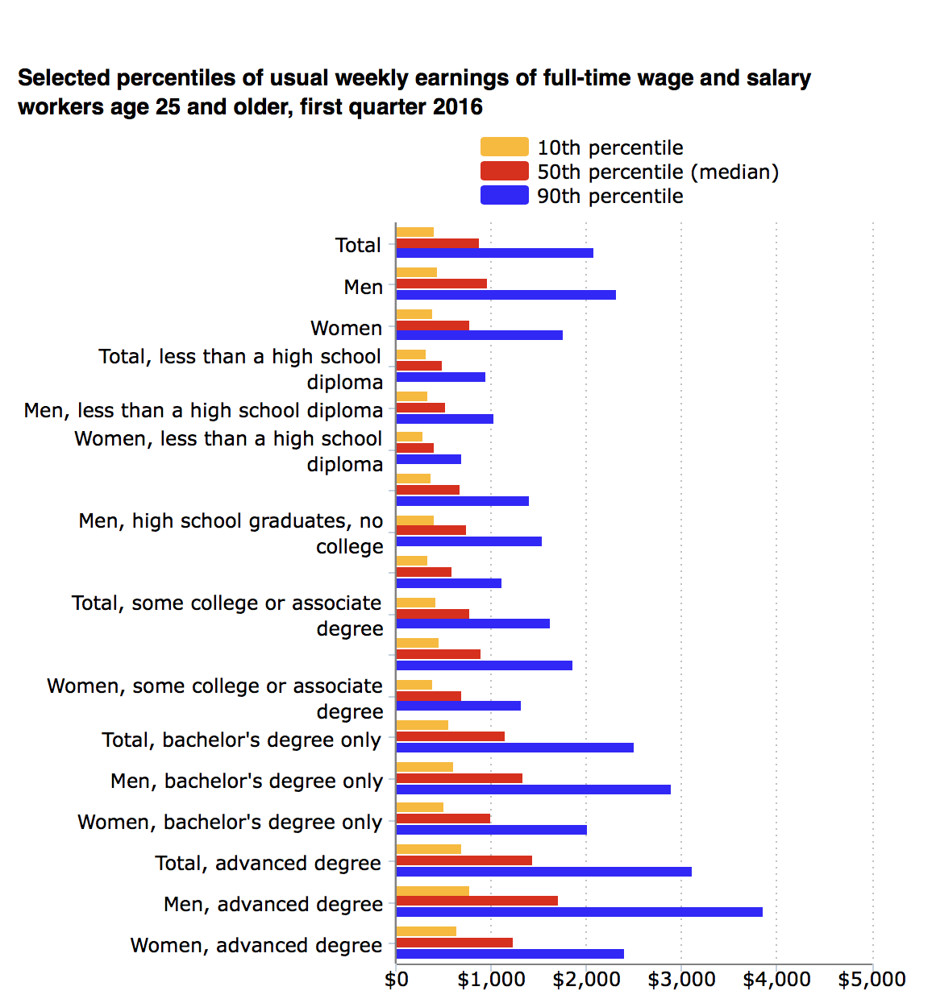

```{r setup, include=FALSE}
library(flexdashboard)

library("tidyverse")
library("plyr")
library("dplyr")
library("magrittr")
library("gdata")
library("ggplot2")
library("plotly")
library("maps")
library("reshape2")
library("GGally")
     
load("final-graphs-p.Rda")
load("data/irs_edu_13.Rda")
```

### **What is the "ACT Achievement Gap?"** 



***
In 2016 ACT [reported](http://www.act.org/content/dam/act/unsecured/documents/R1604-ACT-Composite-Score-by-Family-Income.pdf) that **students, from families with an annual income of \$80,000 or more tend to score about four (4) points higher** than students in families that earn less than \$80,000 a year. 

In 2014 similar results were [reported by the Huffington Post](https://www.huffingtonpost.com/2014/07/18/act-score-family-income_n_5600065.html) and [by the Washington Post](https://www.washingtonpost.com/news/wonk/wp/2014/03/05/these-four-charts-show-how-the-sat-favors-the-rich-educated-families/?utm_term=.56cc245120db) about the ACT and the SAT respectively. And in September 2017, the Washington Post reported that the **Achievement Gap** has, if anything, *worsened* for the ACT: [*‘We didn’t know it was this bad’: New ACT scores show huge achievement gaps*.](https://www.washingtonpost.com/local/education/we-didnt-know-it-was-this-bad-new-act-scores-show-huge-achievement-gaps/2017/09/06/c6397f36-9279-11e7-aace-04b862b2b3f3_story.html?utm_term=.f50e950bb198)

### **How much does it *really* matter?**



***

**It's kind-of a big deal**

[According to the U.S. Bureau of Labor Statistics](https://www.bls.gov/opub/ted/2016/weekly-earnings-by-educational-attainment-in-first-quarter-2016.htm) for 2016 just *going* to college boosted the average U.S. full-time worker's median **income from $679/week** to $782.
And *graduating with a bachelor's* boosted that up **to $1,155/week.** a difference of:

* $3,000/month vs $5,000/month
* **$36,000/year vs $60,000/year!** between holding a highschool diploma and bachelor's degree.


In 2013 the national average ACT composite score was 20.9. 

* With standardized-test scores like the SAT and **ACT** being a major (if not the primary) criteria for college admission in the US, **a four (4) point difference is a big difference!**

### **What does the Achievement Gap look like in TN?**

```{r act_agi_per_return, echo=FALSE}
plot(act_agi_per_return)
```

***
**Correlation of a County's: AGIncome per Household vs ACT Composite**  

* Notice that counties the ACT score distribution for each Income Segment.  

* Counties with **"wealthier"** household-income score **no *lower* than 18.5** on the ACT.**  

* Counties with **"poorer"** household-income score **no *higher* than 19.5.** (With the exception of trousdale which is on the "wealthier end of the poorest segment.")**


### **What Else do ACT-Composite Scores Correlate To?**

```{r corr_matrix, echo=FALSE,fig.width=17, fig.height=16}
plot(corr_matrix)
```

***

**LEGEND:**

*  agi -> adjusted_gross_income
*  sals -> salaries_and_wages_in_agi_household
*  unemp -> unemployment_compensation_household
*  mort_int -> mortgage_interest_paid_household
*  pct_blk -> pct_black
*  pct_hisp -> pct_hispanic
*  pct_nata -> pct_native_american
*  pct_el -> pct_EL
*  pct_swd -> pct_SWD
*  pct_ed -> pct_ED
*  ppe -> per_pupil_expenditures
*  pct_bhn -> pct_BHN
*  ACT -> ACT_composite
*  pct_abs -> pct_chronically_absent
*  pct_sus -> pct_suspended
*  pct_exp -> pct_expelled
*  grad -> graduation
*  drop -> dropout
*  g_enr -> grade_enrollment
*  g_exp -> grade_expenditure
*  agi_q -> adjusted_gross_income_quantile

