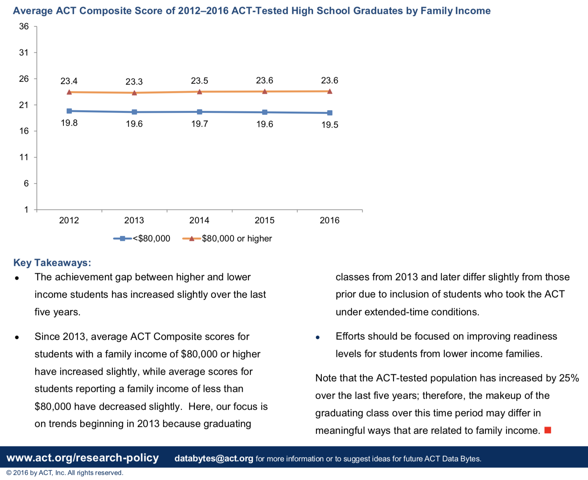

```{r setup, echo=FALSE, include=FALSE}
library("tidyverse")
library("plyr")
library("dplyr")
library("magrittr")
library("gdata")
library("ggplot2")
library("plotly")
library("maps")
library("reshape2")
library("GGally")
     
load("final-graphs-p.Rda")
load("data/irs_edu_13.Rda")
```


#How Did **Income** Affect **Education** in Tennessee in the 2014 - 2015 Academic Year?
```{r agi_by_county, echo = F, fig.width=20, fig.height=17}
plot(agi_by_county)
```

  In 2016 **ACT** [reported](http://www.act.org/content/dam/act/unsecured/documents/R1604-ACT-Composite-Score-by-Family-Income.pdf) that students, from families with an annual income of \$80,000 or more tend to score about four (4) points higher than students in families that earn less than \$80,000 a year. 



## It's kindof a big deal

* In 2013 the national average ACT composite score was 20.9. 

* With standardized-test scores like the SAT and **ACT** being a major (if not the primary) criteria for college admission in the US, **a four (4) point difference is a big difference!**

    In 2014 similar results were [reported by the Huffington Post](https://www.huffingtonpost.com/2014/07/18/act-score-family-income_n_5600065.html) and [by the Washington Post](https://www.washingtonpost.com/news/wonk/wp/2014/03/05/these-four-charts-show-how-the-sat-favors-the-rich-educated-families/?utm_term=.56cc245120db) about the ACT and the SAT respectively. And in September 2017, the Washington Post reported that the **Achievement Gap** has, if anything, *worsened* for the ACT: [*‘We didn’t know it was this bad’: New ACT scores show huge achievement gaps*.](https://www.washingtonpost.com/local/education/we-didnt-know-it-was-this-bad-new-act-scores-show-huge-achievement-gaps/2017/09/06/c6397f36-9279-11e7-aace-04b862b2b3f3_story.html?utm_term=.f50e950bb198)

# Objective: 
### Determine how the **Achievement Gap** can be measured in **TN** with the publicly-available data from the:

* **TN Department of Education** *Data & Research* [website: tn.gov/education/data](https://www.tn.gov/education/data/data-downloads.html)

* **IRS** *Individual Income Tax Statistics* [website: irs.gov/statistics](https://www.irs.gov/statistics/soi-tax-stats-individual-income-tax-statistics-zip-code-data-soi)

#### Databases used:

* Tn. Dept. of Ed. Highschool Achievement Profile Data from the 2014 - 2015 academic year. 

* IRS income-tax-return data from 2013
    + Because 2013 taxes are (expected to be) collected in April 2014, and classes begin in August 2014.

# "Wealth Bubbles"  

### Wealth Distribution Across TN
  Using the *2013 IRS Tax Return Data* we can plot a bubble for each (inhabited) zipcode in TN. And we can:
  
* Make the bubbles larger according to the IRS's population estimates for 2013

* Make the bubbles darker according to each zipcode's Adjuste Gross Income per capita (zipcode AGI divided by zipcode Population). 

####  The results are a bubbles that represent the "wealth concentration" across TN.
* A large light bubble represents a large population with a small AGI per capita
* A small dark bubble represents a small population with a high AGI per capita
  
```{r combo_chloro1, echo=FALSE, fig.width=20, fig.height=17}
plot(combo_chloro1)
```

### Using this data we can represent each *county's* Adjusted Gross Income (AGI) as shades of blue.  
  We achieve this by adding up the AGI of of each zip code within a County. 
```{r combo_chloro2, echo = F, fig.width=20, fig.height=17}
plot(combo_chloro2)
```

##Let's compare a county's AGI with its ACT composite-scores.  

We achieve this by taking the weighted average of each district's ACT composite-score to obtain the county's ACT score.

#### We can see that the "richest" counties do not necessarily have the highest ACT scores. 

```{r combo_chloro3, echo=F, fig.width=20, fig.height=17}
plot(combo_chloro3)
```

### This surprising result could be explained many ways.

* Maybe some rich counties have more students
    + *So, maybe each student in a rich county actually gets less dollars for their education*
        
* Maybe some poor counties have fewer students
    + *So, maybe each student actually gets more dollars for their education*
    
### So, let's look at which counties spend more on each student (Per Pupil Expenditure)
* Darker counties indicate higher per pupil expenditure
* Bigger brighter names indicate higher ACT composite scores
* Smaller fainter names indicate lower ACT composite scores

```{r act_counties, echo=FALSE, fig.width=20, fig.height=17}
plot(act_counties)
```

#### Even when we adjust the color to look at Per-Pupil Expenditure We notice interesting variation.  

##### How many dollars each student has spent on them does not seem to reflect an **Achievement Gap**.  
  But notice that how much money your public school spends on each student is not the same thing as how much money each student's parents/household makes.  

### Drilling down to the granularity of each district's academic-subject perfomance also shows too much variation to be obviously conclusive

#### School Subjects of the Top 5 Vs. Bottom 5 AGI Per Return
* To visualize the academic performances of students in wealthier counties, we compared the grade averages of students in the five counties with the highest AGI per tax return against those of the five counties with the lowest AGI per return.

```{r top_5_agi_facet, echo=FALSE,  fig.width=20}
plot(top_5_agi_facet)
```
```{r bot_5_agi_facet, echo=FALSE,  fig.width=20}
plot(bot_5_agi_facet)
```
  
  
* Williamson, Knox, and Wilson counties tend to have higher grade averages than the bottom five counties.  
  But, Fayette and Davidson counties have high AGI per returns but tend to perform similarly to the bottom five counties.
   
# Let's Get Statistical     
## Here is a *trés fancy* **"correlation matrix"**
### It shows how much of a statistical correlation there is between each of these *Key Metrics.* Some of them come from IRS tax data, and some of them come from TN's Dept. of Ed data.

*  agi -> adjusted_gross_income
*  sals -> salaries_and_wages_in_agi_household
*  unemp -> unemployment_compensation_household
*  mort_int -> mortgage_interest_paid_household
*  pct_blk -> pct_black
*  pct_hisp -> pct_hispanic
*  pct_nata -> pct_native_american
*  pct_el -> pct_EL
*  pct_swd -> pct_SWD
*  pct_ed -> pct_ED
*  ppe -> per_pupil_expenditures
*  pct_bhn -> pct_BHN
*  ACT -> ACT_composite
*  pct_abs -> pct_chronically_absent
*  pct_sus -> pct_suspended
*  pct_exp -> pct_expelled
*  grad -> graduation
*  drop -> dropout
*  g_enr -> grade_enrollment
*  g_exp -> grade_expenditure
*  agi_q -> adjusted_gross_income_quantile

```{r corr_matrix, echo=FALSE,fig.width=17, fig.height=16}
plot(corr_matrix)
```

#### In the middle of the diagonal you can find "ACT" and in the bottom left you can find "agi" the correaltion matrix shows that there is actually not a very strong positive correlation between Adjusted Gross Icome (AGI) and ACT scores, but there is a strong negative correlation between ACT scores and the percentage of economically disadvantaged students in a county.

##### It may be suprising that economically disadvantaged counties have worse ACT scores, but that counties with high AGI do not necessarily have better ACT scores. But that's because it really depends how you measure the money. 

* *We could calculate what percentage of a County's Income each student gets (but that's going to be a very small percent).*
```{r ppe_over_agi, echo=FALSE,fig.width=14, fig.height=3}
plot(ppe_over_agi)
```

* *We could calculate what percentage of a County's Education-Budget/Expenditure each student gets (not as small, but still pretty small).*
```{r ppe_over_exp, echo=FALSE,fig.width=14, fig.height=3}
plot(ppe_over_exp)
```

* *We could calculate the "brute" amount of dollars each student gets.*
```{r ppe, echo=FALSE,fig.width=14, fig.height=3}
plot(ppe)
```

* *And Compare them to each county's ACT score*
```{r act, echo=FALSE,fig.width=14, fig.height=3}
plot(act)
```

### Perhaps surprisingly, the *brute* amount of dollars each student "*receives*" in a county (a county's per-pupil expenditure) is not the best predictor of that county's average ACT score. 

## County Expenditure
### Money distribution
 We wanted to determine how a county's education expenditure compared to its adjusted gross income as well as how that expenditure related to the overall Tennessee education budget.
 The following graph indicates that counties with a high expenditure-to-AGI ratio typically do not have budgets that make up a significant portion of TN's overall budget. On the other hand, the counties that tend to have a lower expenditure-to-AGI ratio require more of TN's total education budget.
 
```{r agi_county_prc, echo=FALSE}
plot(agi_county_prc)
```


## Household Wealth And The ACT  

### County AGI Per Return Impact on ACT Performance  

 Having heard the rumors of wealthier students performing better on standardized tests, we wanted to put this to the test. In taking the average AGI per return, we had a reasonable idea of the wealth of each household in each county. The plotting of this metric against the average ACT score indicates that a moderately strong correlation exists between the two. In other words, the data suggests that the students in counties with wealthier households tend to score higher on the ACT.

```{r act_agi_per_return, echo=FALSE}
plot(act_agi_per_return)
```

#Conclusion:
### We were able to confrim an observation of the **Achievement Gap** in TN; but only at the county level. This is likely due to the fact that our Income and ACT data only matched when "zoomed out" to the County Level. 

```{r act_agi_irs, echo=FALSE}
plot(act_agi_irs)
```

## We can summarize the results in a narrower correlation matrix

* enr -> county_enrollment
* exp -> county_expenditure
* act -> county_ACT_composite
* ppe -> county_per_pupil_expenditure
* agi -> county_adjusted_gross_income
* num_returns -> county_number_of_returns
* ppe_agi -> ppe_as_percentage_of_county_agi
* ppe_exp -> ppe_as_percentage_of_county_expenditure

```{r final_corr, echo=FALSE}
plot(final_corr)
```
